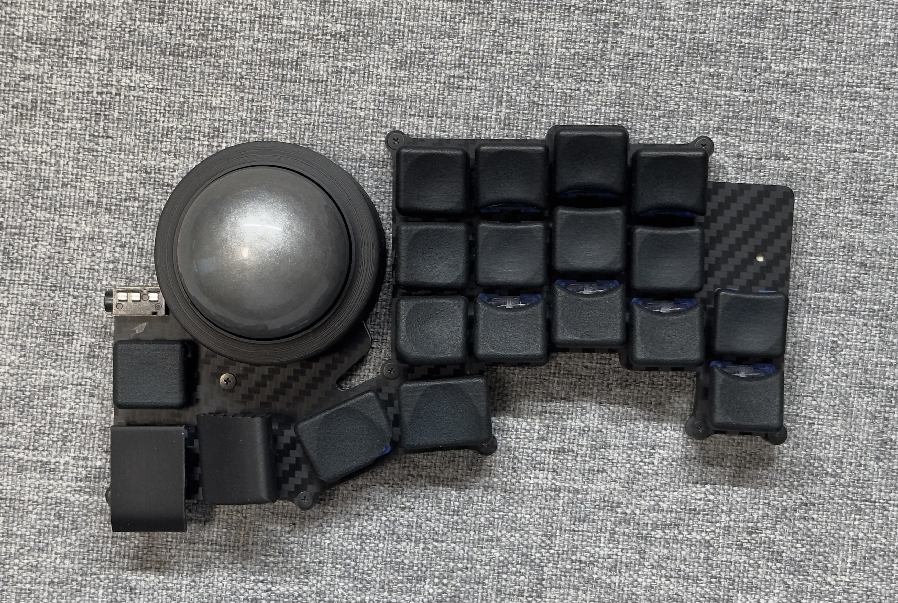

# EvoRoll v4

左側を haqua34、右側を EvoRoll として使うことを想定している

> NOTE: KiCad 7 を使用しています

## v3 からの変更点

> NOTE: 基板はv3のものを使用

* ケース関連を家の3Dプリンタでも印刷できるようにした
* 支持球にジルコニアボールを使えるようにした

## 部品

| 部品                        | リンク                                                                      | 備考                                                                                                               |
| --------------------------- | --------------------------------------------------------------------------- | ------------------------------------------------------------------------------------------------------------------ |
| PMW3360ブレークアウトボード | [monkeypad/pmw3360-breakout](https://github.com/monkeypad/pmw3360-breakout) | Booth で購入したら、ピンヘッダーもついていたけど、おそらく[これ](https://www.hirosugi-net.co.jp/shop/c/c12103211/) |
| ピンソケット 8ピン          | https://www.hirosugi-net.co.jp/shop/c/c12111211/                            | FSR-41085-08 / 8.5mmのものを使用する                                                                               |
| スペーサー M2 5mm           | https://www.hirosugi-net.co.jp/shop/c/c10141012/                            | トッププレートとボトムプレートを止めるために使用する                                                               |
| ねじ M2 3mm                 | https://wilco.jp/products/F/FX-EB.html#page3                                | トッププレートとボトムプレートを止めるために使用する                                                               |
| RP2040-Zero                 |                                                                             |                                                                                                                    |
| ダイオード                  |                                                                             |                                                                                                                    |
| chocソケット                |                                                                             |                                                                                                                    |
| TRRSソケット                |                                                                             |                                                                                                                    |

そのほかの部品については [stl](./stl/) フォルダを参照

## ケース

[stl](./stl/) フォルダを参照

## ファームウェア

https://github.com/tamago324/keyboard-firmwares/tree/master/keyboards/evoroll

## LICENSE

 この 作品 は <a rel="license" href="http://creativecommons.org/licenses/by-nc/4.0/">クリエイティブ・コモンズ 表示 - 非営利 4.0 国際 ライセンス</a>の下に提供されています。

> 表示 — あなたは 適切なクレジットを表示し、ライセンスへのリンクを提供し、変更があったらその旨を示さなければなりません。これらは合理的であればどのような方法で行っても構いませんが、許諾者があなたやあなたの利用行為を支持していると示唆するような方法は除きます。
>
> 非営利 — あなたは営利目的でこの資料を利用してはなりません。