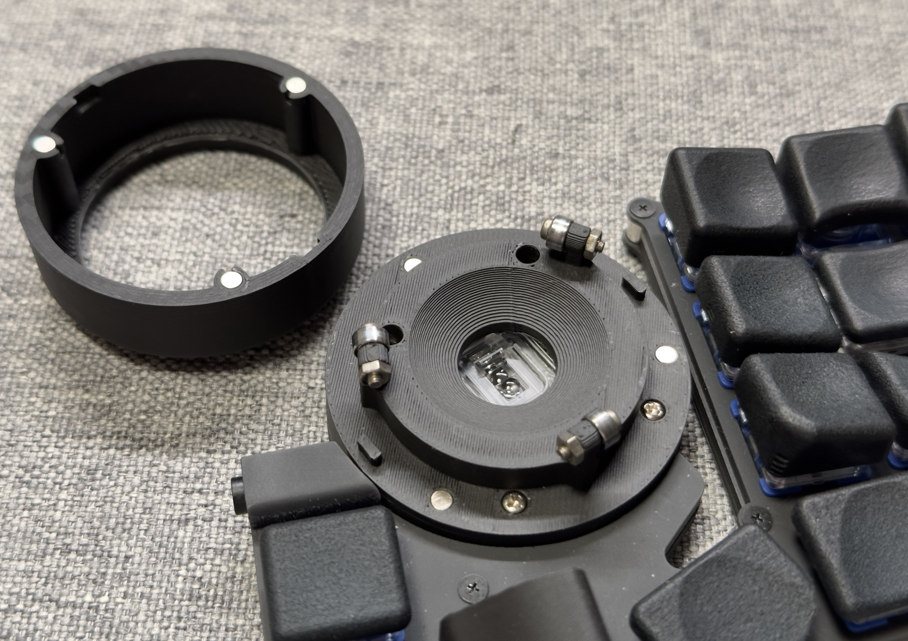
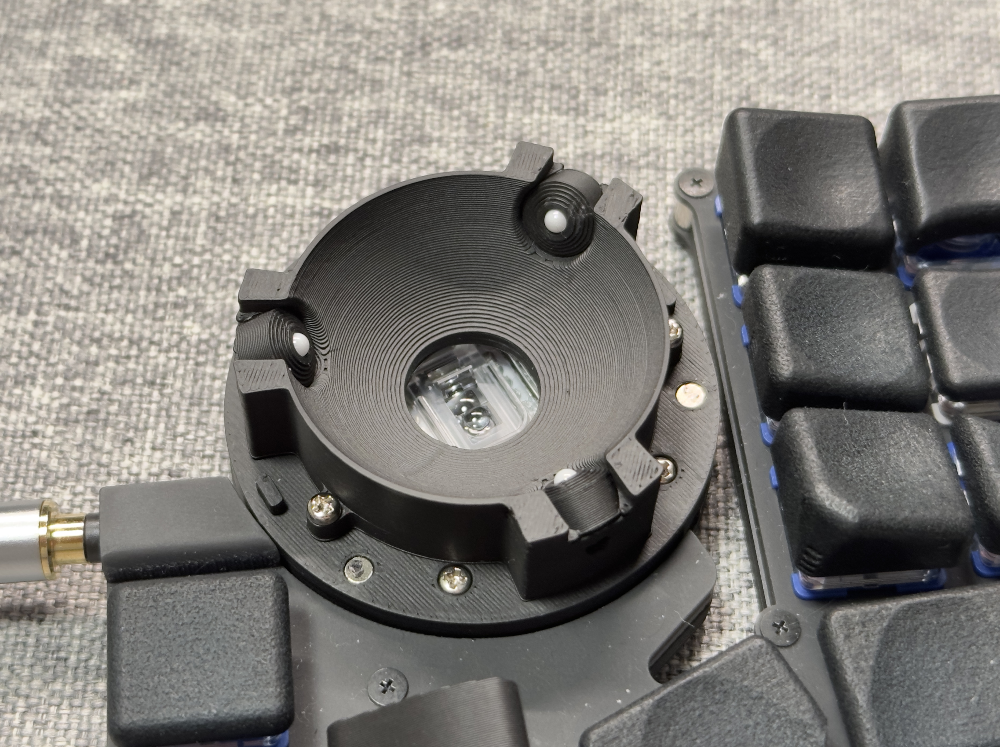

# EvoRoll で使用するケース

## 共通

共通で印刷するもの

* [common/top_case.stl](common/top_case.stl): トッププレート
* [common/bottom_case.stl](common/bottom_case.stl): ボトムプレート

## ボールケース

### ベアリングA (DDL-520ZZW52)

印刷するもの

* [ballcase/bearing/ballcase_bottom_DDL-520ZZW52.stl](ballcase/bearing/ballcase_bottom_DDL-520ZZW52.stl)
* [ballcase/ballcase_top.stl](ballcase/ballcase_top.stl)

必要なもの

|名称|URL|説明|
|---|---|---|
|ベアリング|https://amzn.asia/d/8OED4Yl|DDL-520ZZW52 / 内径2mm、外形5mm、幅2.5mm|
|ねじ M2, 8mm||なべ小ねじならなんでもOK (頭径3.5mm、高さ1.3)|
|ナット M2|||
|タッピングネジ M2, 8mm|https://wilco.jp/products/F/FPP-N.html|ボトムプレートとボールケースを止めるために使用する。|
|磁石 3x2mm|https://amzn.asia/d/gBrgy0N|ケースに押し付けて入れる|

### ベアリングB (DDR-620ZZY52)

印刷するもの

* [ballcase/bearing/ballcase_bottom_DDR-620ZZY52.stl](ballcase/bearing/ballcase_bottom_DDR-620ZZY52.stl)
* [ballcase/ballcase_top.stl](ballcase/ballcase_top.stl)

必要なもの

|名称|URL|説明|
|---|---|---|
|ベアリング|https://www.monotaro.com/p/0953/7586/|DDR-620ZZY52 / 内径2mm、外形6mm、幅2.5mm|

ベアリング以外は、ベアリングAと同じ

### 静的ベアリング (Charybdis の [Static Bearing Mod](https://github.com/Bastardkb/Charybdis/blob/main/files/mods/readme.md#static-bearing-mod) のパーツを使用)

印刷するもの

* [ballcase/static_bearing/ballcase_bottom_static_bearing_A.stl](ballcase/static_bearing/ballcase_bottom_static_bearing_A.stl)
* [ballcase/static_bearing/ballcase_bottom_static_bearing_B.stl](ballcase/static_bearing/ballcase_bottom_static_bearing_B.stl)
* [ballcase/static_bearing/printable_btu_2.5mm_ball.stl](ballcase/static_bearing/printable_btu_2.5mm_ball.stl)
  * [Charybdis の model](https://github.com/Bastardkb/Charybdis/blob/main/files/mods/static-bearing/printable_btu_2.5mm_ball.stl)と同じもの
* [ballcase/ballcase_top.stl](ballcase/ballcase_top.stl)

必要なもの

|名称|URL|説明|
|---|---|---|
|2.5mm ジルコニアボール|https://www.amazon.co.jp/dp/B07TJQN36D||
|タッピングネジ M2, 8mm|https://wilco.jp/products/F/FPP-N.html|ボトムプレートとボールケースAを止めるために使用する。|
|タッピングネジ M2, 5mm|https://wilco.jp/products/F/FPP-N.html|ボールケースAとボールケースBを止めるために使用する。|
|磁石 3x2mm|https://amzn.asia/d/gBrgy0N|ケースに押し付けて入れる|
